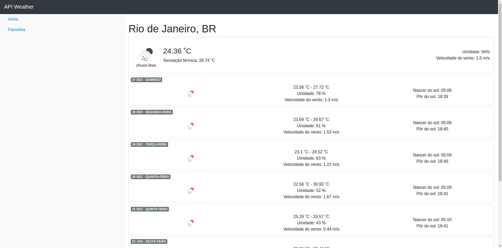
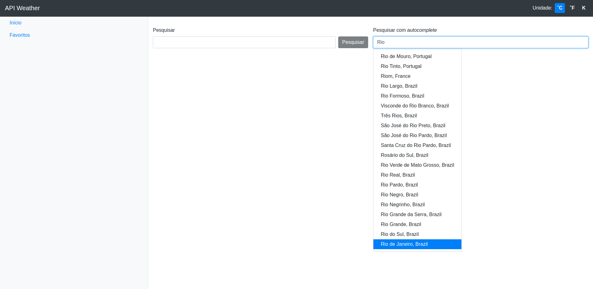

# API Previsão do tempo
- O teor do projeto é dado por uma requisição de dados de uma API para gerar a previsão do tempo atual por cidade com Angular. Desafio proposto pelo bootcamp da empresa Everis.
- Foi criado uma conta na [openweathermap](https://openweathermap.org/) para obter a API Key.

## Material de apoio
- [NGRX](https://ngrx.io) -> Reactive State for Angular. Inspirado no Redux. Processo de um "store centralizado" que vai guardar o estado da aplicação.

- [Angular CDK](https://material.angular.io)

## Instalação
I - Clone o repositório `git clone git@github.com:jonathanmagliano/api-weather.git`
II - Entre no projeto e instale as dependências `npm install`

## Development server

This project was generated with [Angular CLI](https://github.com/angular/angular-cli)

Run `ng serve` for a dev server. Navigate to `http://localhost:4200/`. The app will automatically reload if you change any of the source files.

## Further help

To get more help on the Angular CLI use `ng help` or go check out the [Angular CLI README](https://github.com/angular/angular-cli/blob/master/README.md).
